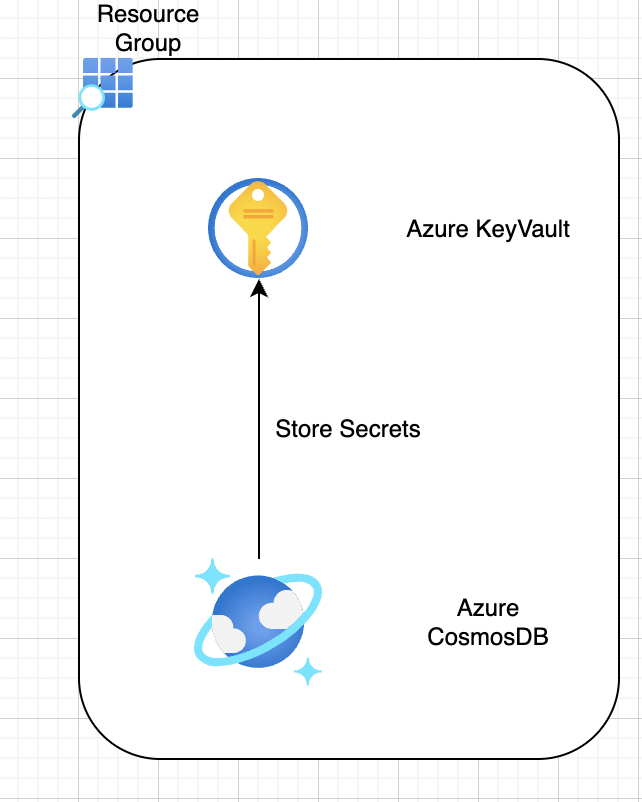

# Introduction 
 This is the terraform script to create Resource Group, Key Vault, KV Access Policy, Key Vault Secrets & Cosmos DB

# Folder Structure
 	main 
        main -> which has main terraform scripts
        variables -> is having all the variables and default values
        providers.tf -> is having all the providers required
        README.md -> is containing all the help
    modules  -> will have all the sub folders where respetive modules are written
        cosmosdb
        keyvault
        keyvaultsecret
        resourcegroup

# Pre-requisites
   1. Need to have Azure service principal -> with contributor role is assigned
   2. Set below envirnment variables
	    ARM_TENANT_ID
	    ARM_SUBSCRIPTION_ID
	    ARM_CLIENT_ID
	    ARM_CLIENT_SECRET

# Terraform commands
    - Run all the terraform commands from tf_main folder
    - No need to import/reference. With in the folder, terraform understands and reads all the .tf files
    ---------
    terraform init
    terraform validate
    terraform plan
    terraform apply
    terraform destroy
    ---------

# Description & Notes
- Create a resource group module first and call it in main.tf
- Create a key vault module and call it main.tf
- Make sure to create access policy in key vault (because though you create key vault, unless you access it, you will not be able to write secrets to it)
- Create a module for cosmosdb and call it main.tf (make sure to write outputs as they may need to push into keyvault)
- Create a module for keyvault secret and call it in main.tf (make sure to push the cosmos db outputs as keyvault secrets )

